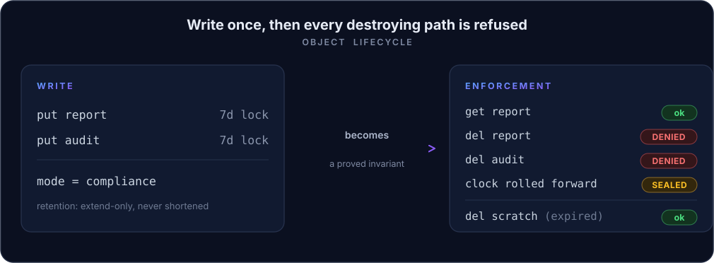
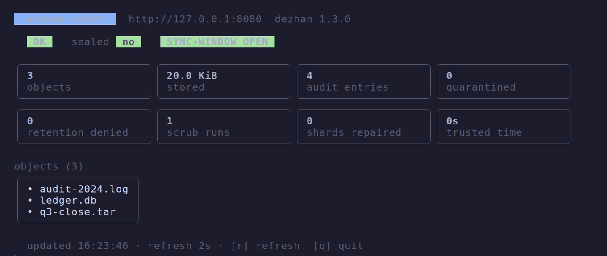

<div align="center">

<h1>dezhan</h1>

<p><b>Write-once backups whose immutability is a machine-checked theorem, not a configuration flag.</b></p>

<p>
  <a href="https://github.com/obsernetics/dezhan/actions/workflows/ci.yml"></a>
  <a href="scripts/prove.sh"></a>
  <a href="https://opensource.org/licenses/Apache-2.0"></a>
  <br/>
  
  
  <a href="https://obsernetics.github.io/dezhan/"></a>
</p>


</div>

## What it is

A backup is only worth what you can prove about it the morning you need it. The
modern ransomware playbook is not to encrypt your data first; it is to delete the
backups first, then encrypt.

dezhan closes that door. When you write an object under a retention, the vault
refuses to delete it, shorten its retention, or expire it early until the clock
legitimately passes the deadline. That refusal is not a policy check an admin
flag can turn off. It is a small SPARK state machine, proved by `gnatprove` to
have no execution path that deletes a retained object.

It speaks S3, so your existing backup tools write to it unchanged: `restic`,
Velero, Veeam, `aws-cli`, `boto3`. It runs on-prem and fully air-gapped with no
external runtime dependency. Where tools like Veeam lean on storage-layer
immutability, dezhan proves the guarantee in its own core.

<p align="center">
  
</p>

## Control CLI and live dashboard

`dezhanctl` is a control CLI with a live TUI dashboard. It reads the vault's
plain control plane (`/healthz`, `/version`, `/metrics`, `/v`), so it needs no
AWS SDK and works against a local or air-gapped server.



```sh
cd ctl && go build -o dezhanctl .
export DEZHAN_ENDPOINT=http://127.0.0.1:8080

dezhanctl dashboard            # live TUI: health, seal state, objects, audit, scrub
dezhanctl dashboard --frame    # one styled frame, for logs or a wall display
dezhanctl put report --file ./q3-close.tar --mode compliance --retain 86400
dezhanctl stat report          # object metadata (HEAD)
dezhanctl get report -o ./out  # fetch to a file
dezhanctl ls --json            # machine-readable output on any query command
dezhanctl del report           # refused while the object is retained
dezhanctl admin scrub --admin-token "$DEZHAN_ADMIN_TOKEN"   # token-gated ops
dezhanctl completion bash      # shell completion (bash|zsh|fish|powershell)
```

## What it proves

Four things in the trusted core are written in SPARK and machine-checked by
`gnatprove`: **325 verification conditions, 0 unproved**, on every commit. Not
tested. Proved.

| Verified component | Invariant it guarantees | How |
|---|---|---|
| Retention state machine | retention may be extended, never shortened; a retained object cannot be deleted before expiry | SPARK contracts, discharged by `gnatprove` |
| Clock-integrity guard | a rewound or tampered clock cannot expire a lock; the vault seals instead of releasing | proved monotonic trusted time |
| Append-only audit chain | every operation is hash-chained; history cannot be rewritten undetectably | proved append-only structure |
| Erasure coding | data survives drive loss and reconstructs exactly, or is quarantined, never returned wrong | proved reconstruction |

The cryptography (SHA-256/512, ChaCha20, HMAC, Ed25519) is implemented in-tree
with no external runtime dependency, so the whole integrity path is auditable in
one place. Design notes and current limits: [`docs/NOTES.md`](docs/NOTES.md).

## Speaks S3

Point any S3 client at the endpoint. Standard S3 is validated against the AWS
SDK: buckets, objects, range reads, copy, batch delete, multipart, versioning
with delete markers, user metadata, conditional requests, presigned URLs, SigV4,
and Object Lock / WORM with legal hold.

```sh
ALIAS="aws --endpoint-url http://localhost:8080 --region us-east-1"
$ALIAS s3 mb s3://backups
$ALIAS s3 cp ./data.tar s3://backups/                 # any size, multipart handled
$ALIAS s3api create-bucket --bucket vault --object-lock-enabled-for-bucket
$ALIAS s3 cp important.bak s3://vault/
$ALIAS s3 rm  s3://vault/important.bak                 # refused until retention expires
```

Buckets are mutable (Standard) by default; enabling Object Lock makes a bucket
Immutable/WORM. A minimal `dezhan_cli` also ships in the image; more examples
(`restic`, `boto3`, Velero, the operator CR) are in [`examples/`](examples/).

## Measured, not asserted

The proof is a hard gate, not a report: [`scripts/prove.sh`](scripts/prove.sh)
runs `gnatprove` and CI **fails on a single unproved check**, so the invariants
stay machine-proved on every commit.

dezhan trades write speed for durability. Every object is content-addressed,
ChaCha20-encrypted per chunk, Reed-Solomon erasure-coded, and fsync'd, so writes
are deliberately slow (about 1.2 MB/s at 4 MiB, small objects fsync-bound near
1 op/s) while reads are faster (about 37 MB/s at 4 MiB). Per-chunk work runs in
parallel across cores, and objects of any size store and restore. Against Veeam,
the closest immutable-backup product, the difference is how immutability is
guaranteed: dezhan proves the delete-before-expiry path unreachable in its core,
where Veeam enforces it in the storage layer. Full tables and the capability
comparison: [`bench/results/COMPARISON.md`](bench/results/COMPARISON.md).


## Quick start

On-prem (pulls the image, runs it, prints generated credentials):

```sh
curl --proto '=https' --tlsv1.2 -sSf https://raw.githubusercontent.com/obsernetics/dezhan/main/install.sh | sh
```

Kubernetes operator, then declare a vault:

```sh
kubectl apply -f https://raw.githubusercontent.com/obsernetics/dezhan/main/deploy/dezhan.yaml
```

```yaml
apiVersion: dezhan.obsernetics.io/v1alpha1
kind: DezhanVault
metadata:
  name: my-vault
spec:
  storage: 100Gi
  requireAuth: true
  deleteQuorum: 2                # deletes need 2 approver co-signatures
  secretName: my-vault-secrets   # DEZHAN_VAULT_KEY, DEZHAN_SECRET, ...
```

Reach the vault in-cluster at `http://my-vault.<namespace>.svc:8080`.

## Architecture

A vault is a **single writer over durable storage**: a one-replica StatefulSet
on a `ReadWriteOnce` volume. Do not scale it; the immutability and audit-chain
guarantees assume one writer, and cross-node durability comes from the
StorageClass beneath it. The pod runs non-root, read-only root filesystem, all
capabilities dropped, with only `/data` writable. Three images are published to
GHCR from one code base: **`dezhan`** (the vault server, all you need for a plain
install), **`dezhan-operator`** (reconciles a `DezhanVault` custom resource), and
**`dezhan-csi`** (exposes a vault as PersistentVolumes, one bucket per PVC).

## Configuration

`dezhan_server [port] [data-dir]`. Endpoints: `GET /healthz`, `GET /metrics`
(Prometheus), `POST /admin/{seal,scrub,checkpoint,gc}`, and a web UI at `/`.

| Variable | Meaning | Default |
|---|---|---|
| `DEZHAN_VAULT_KEY` | passphrase the data key is wrapped under | demo key |
| `DEZHAN_REQUIRE_AUTH` | reject unsigned requests | unset (anonymous) |
| `DEZHAN_ACCESS_KEY` / `DEZHAN_SECRET` | the S3 credential | `dezhanadmin` / demo |
| `DEZHAN_CREDENTIALS` | extra `accesskey secret [default] [bucket:perm ...]` lines | `<root>/credentials` |
| `DEZHAN_TOKENS` | API token / service-account lines `token accesskey` | `<root>/tokens` |
| `DEZHAN_ADMIN_TOKEN` | token (`X-Dezhan-Admin-Token`) gating `/admin/*` | unset |
| `DEZHAN_DELETE_QUORUM` / `DEZHAN_APPROVERS` | four-eyes deletes | `0` / unset |
| `DEZHAN_SCRUB_INTERVAL` | seconds between integrity scrubs | `300` |
| `DEZHAN_CHECKPOINT_INTERVAL` / `DEZHAN_GC_INTERVAL` | seconds between checkpoints / GC (0 = off) | `0` |

Each credential has a default access level (`rw`, `ro`, `none`) plus optional
per-bucket overrides. With `DEZHAN_DELETE_QUORUM` set, a delete needs approver
co-signatures. Run `sh scripts/smoke.sh` for a `boto3` conformance check. The
operator reconciles a `DezhanVault` into a StatefulSet, Service, PVC, and
PodDisruptionBudget; a ready-to-edit sample and the CSI StorageClass are under
[`operator/config/samples`](operator/config/samples) and [`deploy/csi/`](deploy/csi/).

## Development

All builds and proofs run inside the project's KVM guest (the host stays clean);
see [`CLAUDE.md`](CLAUDE.md) and [`Makefile`](Makefile).

```sh
gprbuild -P dezhan.gpr           # build server, CLI, verifier
sh scripts/test.sh               # unit tests
sh scripts/prove.sh              # SPARK proof gate (hard)
( cd operator && go build ./... && go test ./... )
( cd csi && go build ./... && go test ./... )
( cd ctl && go build ./... && go vet ./... && go test ./... )   # dezhanctl
```

The demo GIF is rendered by [charmbracelet/vhs](https://github.com/charmbracelet/vhs)
from [`docs/assets/demo.tape`](docs/assets/demo.tape); its output reproduces a
real run of the built binaries. The landing page at
<https://obsernetics.github.io/dezhan/> is generated from this repo's own sources
so it cannot drift: [`scripts/gen-site.py`](scripts/gen-site.py) injects the live
throughput, proof count, and release version into the template at deploy time.

## Status

Provable immutability is the point, and the retention invariant is proved today.
Shipping now: the S3 data plane (buckets, versioning, multipart, copy, batch
delete, SigV4), large-object storage at any size with parallel per-chunk
encrypt-and-erasure-code, background scrub and self-heal, a signed audit chain
and independent verifier, the Kubernetes operator and CSI driver, and the
`dezhanctl` dashboard. It is still early software: a `v1alpha1` operator API and
an MVP scope (tape, database movers, and OIDC/LDAP are deferred).
[`docs/NOTES.md`](docs/NOTES.md) records what is deferred; nothing here describes
behavior that is not in the tree.

## Contributing

Contributions are welcome. Open an issue for substantial changes, and keep the
proof gate green: a change that weakens an invariant has to update the SPARK
contract and still pass `gnatprove`.

## License

Licensed under the [Apache License 2.0](LICENSE).
