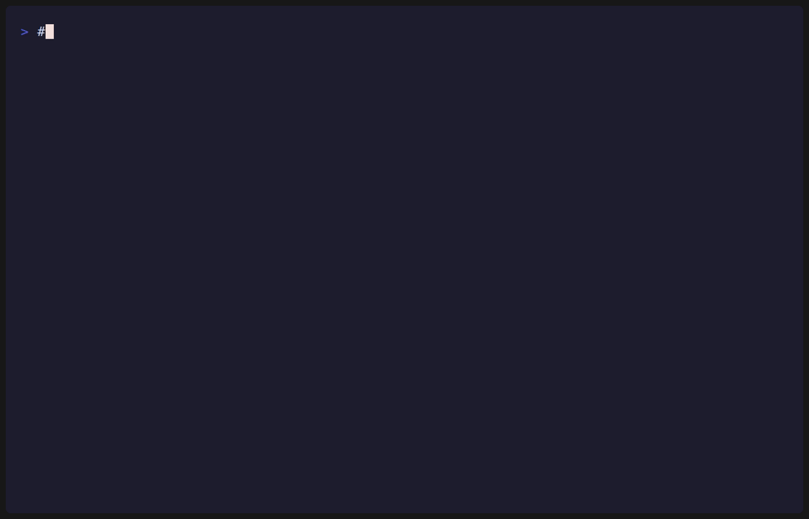
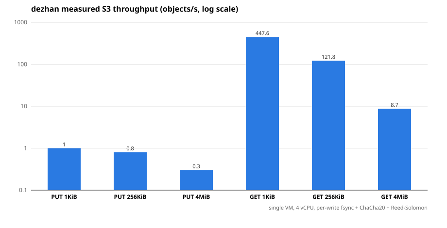

<div align="center">

<h1>dezhan</h1>

<p><b>Write-once backups whose immutability is a machine-checked theorem, not a configuration flag.</b></p>

<p>
  <a href="https://github.com/obsernetics/dezhan/actions/workflows/ci.yml"></a>
  <a href="scripts/prove.sh"></a>
  <a href="scripts/coverage.sh"></a>
  <a href="https://opensource.org/licenses/Apache-2.0"></a>
  <br/>
  
  
  
  <a href="https://obsernetics.github.io/dezhan/"></a>
  <a href="#contributing"></a>
</p>



</div>

## The idea

A backup is only worth what you can prove about it the morning you actually need
it. Ransomware operators and rogue insiders both know this, so the modern
playbook is not to encrypt your data first — it is to delete the backups first,
and then encrypt.

dezhan closes that door. When you write an object under a retention, the vault
refuses to delete it, shorten its retention, or expire it early, until the clock
legitimately passes the deadline. "Refuses" here is not a policy check that an
admin flag can turn off. It is a small state machine whose single job is
**proved**, with `gnatprove`, to have no execution path that deletes a retained
object.

```
  write                                      enforcement
 ┌────────────────────────┐               ┌──────────────────────────────┐
 │ put report   7d lock   │               │ get report             ok     │
 │ put audit    7d lock   │   becomes     │ del report             DENIED │
 │ mode = compliance      │──────────────▶│ del audit              DENIED │
 │                        │   a proved    │ clock rolled forward   SEALED │
 │                        │   invariant   │ ──────────────────────────────│
 │                        │               │ del scratch (expired)  ok     │
 └────────────────────────┘               └──────────────────────────────┘
```

It speaks S3, so nothing about your existing backup tooling has to change: point
`aws-cli`, `restic`, Veeam, Velero, or `boto3` at it. It runs on-prem and fully
air-gapped, with no external runtime dependency. It is an alternative to MinIO
and Veeam for the one job where "probably fine" is not good enough.

## What that buys you

**Your last good copy cannot be erased.** A compromised admin account, a stolen
credential, or ransomware with delete permissions still cannot remove an object
before its retention expires. The delete simply does not happen, and the attempt
is written to an append-only audit chain.

**Compliance you can demonstrate, not just assert.** WORM and S3 Object Lock
exist elsewhere as features. Here the enforcement is a formally verified state
machine, and the proof is re-checked on every commit, so "immutable" is a
property of the build rather than a promise in a datasheet.

**A denial is a proof, not a toggle.** There is no override flag, no support
back door, and no clock trick. The vault either found that the retention had
elapsed or it did not. When dezhan refuses a delete, the object is still there,
byte for byte, and it will be there tomorrow.

## The trade, stated plainly

Immutability an attacker cannot bypass is immutability **you** cannot bypass
either.

If you write an object under a compliance-mode retention, you will not delete it
before it expires — not with the admin token, not by moving the system clock,
not by restarting the server. That is not a limitation being worked around; it
is the same mechanism working correctly, and any honest evaluation of this tool
has to start there.

Three things exist because of it: **governance vs compliance** modes, so you
choose how absolute the lock is up front; **retention `0` and natural expiry**,
the deliberate paths by which objects do become deletable; and ordinary S3
versioning on mutable buckets. Immutability is opt-in per bucket and per object,
not a mode the whole system is stuck in.

The other cost is throughput. Every write is `fsync`'d, erasure-coded, and
encrypted before it is acknowledged, so `PUT` is slower than a plain object
store. GET stays within a small factor. The numbers are in [`bench/`](bench/)
and summarized under [Measured, not asserted](#measured-not-asserted).

## What it proves

Four things in the trusted core are written in SPARK and machine-checked by
`gnatprove` — **325 verification conditions, 0 unproved**, on every commit. Not
tested. Proved.

| Verified component | Invariant it guarantees | How |
|---|---|---|
| Retention state machine | retention may be extended, never shortened; a retained object cannot be deleted before expiry | SPARK contracts, discharged by `gnatprove` |
| Clock-integrity guard | a rewound or tampered system clock cannot expire a lock; the vault seals instead of releasing | proved monotonic trusted time |
| Append-only audit chain | every operation is hash-chained; recorded history cannot be rewritten undetectably | proved append-only structure |
| Erasure coding | data survives drive loss and reconstructs exactly, or is quarantined, never returned wrong | proved reconstruction |

The cryptography — SHA-256/512, ChaCha20, HMAC, Ed25519 — is implemented in-tree
with no external runtime dependency, so the entire integrity path is auditable
in one place. Design notes and current limits: [`docs/NOTES.md`](docs/NOTES.md).

## Speaks S3

Point any S3 client at the endpoint. Standard S3 is validated against the AWS
SDK: buckets, objects, range reads, copy, batch delete, multipart, versioning
with delete markers, user metadata, conditional requests, presigned URLs, SigV4,
and Object Lock / WORM with legal hold.

```sh
ALIAS="aws --endpoint-url http://localhost:8080 --region us-east-1"
$ALIAS s3 mb s3://backups
$ALIAS s3 cp ./data.tar s3://backups/                 # any size; multipart handled
$ALIAS s3api create-bucket --bucket vault --object-lock-enabled-for-bucket
$ALIAS s3 cp important.bak s3://vault/
$ALIAS s3 rm  s3://vault/important.bak                 # refused until retention expires
```

Or the built-in CLI that ships in the image (this is the flow in the demo above):

```sh
dezhan_cli health                                   # ok / sealed
dezhan_cli put report data.tar compliance 86400     # store under a 1-day retention
dezhan_cli get report                               # restores keep working
dezhan_cli del report                               # refused until retention expires
```

Buckets are mutable (Standard) by default; enabling Object Lock makes a bucket
Immutable/WORM. More examples — `restic`, `boto3`, Velero, the operator CR — are
in [`examples/`](examples/).

## Architecture

A vault is a **single writer over durable storage**: a one-replica StatefulSet
on a `ReadWriteOnce` volume. Do not scale it; the immutability and audit-chain
guarantees assume one writer, and cross-node durability comes from the
StorageClass beneath it (Ceph, a cloud disk, Longhorn). The pod runs non-root,
read-only root filesystem, all capabilities dropped, with only `/data` writable.

Three images are published to GHCR and share one code base:

- **`dezhan`** — the vault server. For a plain install this is all you need.
- **`dezhan-operator`** — reconciles a `DezhanVault` custom resource into a
  StatefulSet, Service, PVC, and PodDisruptionBudget.
- **`dezhan-csi`** — exposes a vault as Kubernetes PersistentVolumes, one bucket
  per PVC, mounted with [mountpoint-s3](https://github.com/awslabs/mountpoint-s3).

## Quick start

On-prem — pulls the image, runs it, prints generated credentials:

```sh
curl --proto '=https' --tlsv1.2 -sSf https://raw.githubusercontent.com/obsernetics/dezhan/main/install.sh | sh
```

Kubernetes operator, then declare a vault:

```sh
kubectl apply -f https://raw.githubusercontent.com/obsernetics/dezhan/main/deploy/dezhan.yaml
```

```yaml
apiVersion: dezhan.obsernetics.io/v1alpha1
kind: DezhanVault
metadata:
  name: my-vault
spec:
  storage: 100Gi
  requireAuth: true
  deleteQuorum: 2                # deletes need 2 approver co-signatures
  secretName: my-vault-secrets   # DEZHAN_VAULT_KEY, DEZHAN_SECRET, ...
```

Reach the vault in-cluster at `http://my-vault.<namespace>.svc:8080`. Full CR
spec, resilience notes, and the CSI StorageClass are under
[Kubernetes](#kubernetes) below.

## Measured, not asserted

The proof is a hard gate, not a report. [`scripts/prove.sh`](scripts/prove.sh)
runs `gnatprove` on the trusted core and the CI job **fails on a single unproved
check**, so the mandatory invariants stay machine-proved on every commit.
[`scripts/coverage.sh`](scripts/coverage.sh) holds trusted-core line coverage,
and [`scripts/test.sh`](scripts/test.sh) runs the unit suite.

Throughput is measured the same way — against MinIO as a reference across a
3-node k3s cluster and an on-prem VM. dezhan trades write speed for durability
and integrity, so it is slower than MinIO on `PUT` and within a small factor on
`GET`. Harness, raw results, and tables: [`bench/`](bench/)
(`bench/results/COMPARISON.md`).



## Requirements

- A Linux host with a container runtime, or **Kubernetes 1.24+** for the
  operator and CSI driver.
- Durable block storage for the vault's `/data` (a StorageClass that reattaches
  the volume, for HA).
- Nothing else at runtime: the vault has no external service dependency and runs
  air-gapped by design.

## Configuration

`dezhan_server [port] [data-dir]`. Operations: `GET /healthz`, `GET /metrics`
(Prometheus), `POST /admin/{seal,scrub,checkpoint}`, and a web UI at `/`.

| Variable | Meaning | Default |
|---|---|---|
| `DEZHAN_VAULT_KEY` | passphrase the data key is wrapped under | demo key |
| `DEZHAN_REQUIRE_AUTH` | reject unsigned requests | unset (anonymous) |
| `DEZHAN_ACCESS_KEY` / `DEZHAN_SECRET` | the S3 credential | `dezhanadmin` / demo |
| `DEZHAN_CREDENTIALS` | extra `accesskey secret [default] [bucket:perm ...]` lines | `<root>/credentials` |
| `DEZHAN_TOKENS` | API token / service-account lines `token accesskey` | `<root>/tokens` |
| `DEZHAN_ADMIN_TOKEN` | token (`X-Dezhan-Admin-Token`) gating `/admin/*` | unset |
| `DEZHAN_DELETE_QUORUM` / `DEZHAN_APPROVERS` | four-eyes deletes | `0` / unset |
| `DEZHAN_APPROVAL_TTL` | seconds a staged delete approval stays valid | `3600` |
| `DEZHAN_SCRUB_INTERVAL` | seconds between integrity scrubs | `300` |
| `DEZHAN_CHECKPOINT_INTERVAL` | seconds between audit checkpoints (0 = off) | `0` |
| `DEZHAN_GC_INTERVAL` | seconds between garbage-collection passes (0 = off) | `0` |

Each credential has a default access level (`rw`, `ro`, or `none`) plus optional
per-bucket overrides, e.g. `auditor s3cret none logs:ro`. Service accounts use
API tokens (`Authorization: Bearer <token>`). With `DEZHAN_DELETE_QUORUM` set, a
delete needs approver co-signatures, synchronously or staged. Run
`sh scripts/smoke.sh` for a `boto3` conformance check.

## Kubernetes

The operator reconciles a `DezhanVault` into a single-replica StatefulSet, a
Service, a PVC, and a PodDisruptionBudget, and reports readiness on the resource
status. Reconciles are level-based and idempotent; owned objects are recreated
if deleted; the operator runs two replicas behind leader election.

| Field | Default | Meaning |
|---|---|---|
| `image` | `ghcr.io/obsernetics/dezhan:latest` | server image |
| `port` | `8080` | listen port |
| `storage` | `50Gi` | persistent volume size (raise it to expand online) |
| `storageClassName` | cluster default | PVC storage class |
| `requireAuth` | `true` | reject unsigned requests |
| `deleteQuorum` | `0` | approver co-signatures required to delete |
| `scrubIntervalSeconds` | `0` (server default 300) | verify-and-self-heal interval |
| `secretName` | none | Secret whose keys become server env vars |
| `serviceType` | `ClusterIP` | `ClusterIP` / `NodePort` / `LoadBalancer` |
| `resources` | none | container requests/limits |

Put every secret (`DEZHAN_VAULT_KEY`, `DEZHAN_SECRET`, `DEZHAN_ADMIN_TOKEN`,
`DEZHAN_APPROVERS`) in the referenced Secret; nothing sensitive belongs in the
CR. A ready-to-edit sample is in
[`operator/config/samples`](operator/config/samples).

**As a volume (CSI).** The `dezhan` CSI driver turns a vault into a StorageClass:
each PVC becomes a bucket, mounted on the node via mountpoint-s3. Best for
write-once / append / archival workloads (it matches WORM); not for random-write
volumes such as databases. Edit the endpoint and credentials, then
`kubectl apply -f deploy/csi/`. Volume snapshots server-side-copy a bucket into
an immutable snapshot bucket.

**Observability.** `/metrics` is Prometheus format; the operator annotates each
vault Service for scraping. Apply the ServiceMonitor, Grafana dashboard, alerts,
and an OTel Collector bridge with
`kubectl apply -f operator/config/observability/`.

## Development

All builds and proofs run inside the project's KVM guest (the host stays clean);
see [`CLAUDE.md`](CLAUDE.md) and [`Makefile`](Makefile).

```sh
gprbuild -P dezhan.gpr           # build server, CLI, verifier
sh scripts/test.sh               # unit tests
sh scripts/prove.sh              # SPARK proof gate (hard)
sh scripts/coverage.sh           # trusted-core line coverage
( cd operator && go build ./... && go test ./... )
( cd csi && go build ./... && go test ./... )
```

The demo GIF is rendered by [charmbracelet/vhs](https://github.com/charmbracelet/vhs)
from [`docs/assets/demo.tape`](docs/assets/demo.tape) and
[`docs/assets/demo.sh`](docs/assets/demo.sh), whose output is taken verbatim
from a real run of the built binaries.

## Honest status

Provable immutability is the point, and the retention invariant is proved today.
It is early software: a `v1alpha1` operator API, no public production adopters
yet, and an MVP scope — tape, database movers, and OIDC/LDAP are out until
promoted from the spec. [`docs/NOTES.md`](docs/NOTES.md) records what is
deliberately deferred; nothing in this README describes behavior that is not in
the tree.

## Contributing

Contributions are welcome. Open an issue for substantial changes, and keep the
proof gate green — a change that weakens an invariant has to update the SPARK
contract and still pass `gnatprove`.

## License

Licensed under the [Apache License 2.0](LICENSE).
